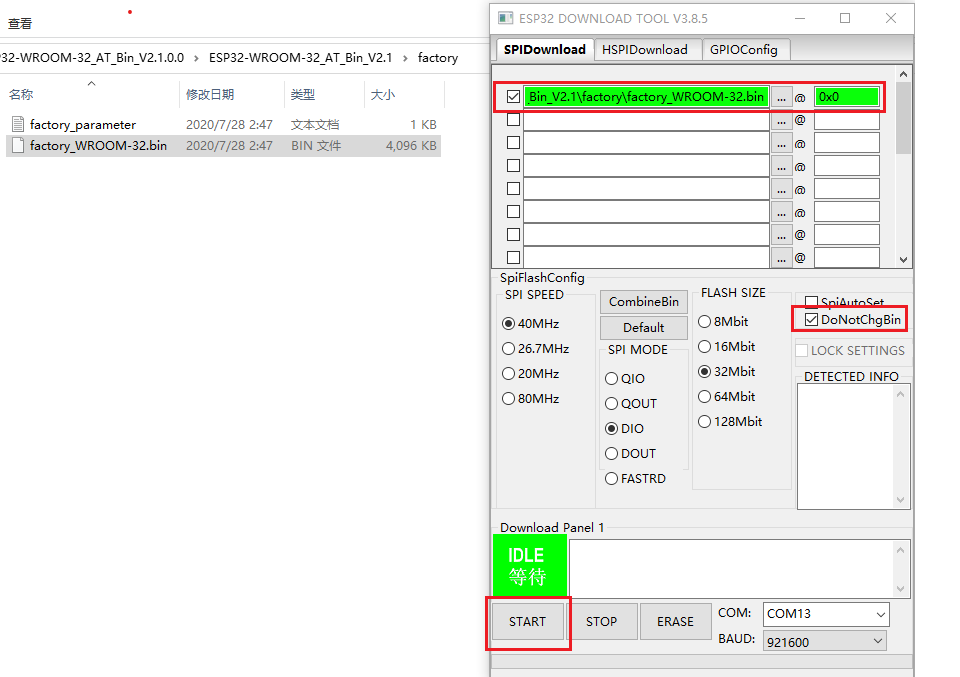

Downloading Guide
=================

This page introduces how to download AT firmware, no matter you use Windows, Linux or MacOS.   
You can download AT firmware from [`AT_Binary_Lists`](https://docs.espressif.com/projects/esp-at/en/latest/AT_Binary_Lists/index.html).  
Herein, we use `ESP32-WROOM-32_AT_Bin_V2.1` as an example.

```
.
├── at_customize.bin                 // secondary partition table
├── bootloader                       // bootloader
│   └── bootloader.bin
├── customized_partitions            // AT customized binaries
│   ├── ble_data.bin
│   ├── client_ca.bin
│   ├── client_cert.bin
│   ├── client_key.bin
│   ├── factory_param.bin
│   ├── factory_param_WROOM-32.bin
│   ├── mqtt_ca.bin
│   ├── mqtt_cert.bin
│   ├── mqtt_key.bin
│   ├── server_ca.bin
│   ├── server_cert.bin
│   └── server_key.bin
├── download.config                  // configuration of downloading
├── esp-at.bin                       // AT application binary
├── factory                          // A combined bin for factory downloading
│   ├── factory_WROOM-32.bin
│   └── factory_parameter.log
├── flasher_args.json                // flasher arguments
├── ota_data_initial.bin             // ota data parameters
├── partition_table                  // primary partition table
│   └── partition-table.bin
└── phy_init_data.bin                // phy parameters
```

The configuration of downloading is in `download.config`

```
--flash_mode dio --flash_freq 40m --flash_size 4MB
0x8000 partition_table/partition-table.bin
0x10000 ota_data_initial.bin
0xf000 phy_init_data.bin
0x1000 bootloader/bootloader.bin
0x100000 esp-at.bin
0x20000 at_customize.bin
0x24000 customized_partitions/server_cert.bin
0x39000 customized_partitions/mqtt_key.bin
0x26000 customized_partitions/server_key.bin
0x28000 customized_partitions/server_ca.bin
0x2e000 customized_partitions/client_ca.bin
0x30000 customized_partitions/factory_param.bin
0x21000 customized_partitions/ble_data.bin
0x3B000 customized_partitions/mqtt_ca.bin
0x37000 customized_partitions/mqtt_cert.bin
0x2a000 customized_partitions/client_cert.bin
0x2c000 customized_partitions/client_key.bin
```
- `--flash_mode dio`: the AT firmware is compiled with flash DIO mode 
- `--flash_freq 40m`: the AT firmware's flash frequency is 40MHz
- `--flash_size 2MB`: the AT firmware is using flash size 2MB 
- `0x10000 ota_data_initial.bin`: to download `ota_data_initial.bin` into address `0x10000 `

## Windows OS
[Click to download ESP Flash Download Tool for Windows](https://www.espressif.com/zh-hans/support/download/other-tools).  
Herein, we use `ESP-WROOM-32` module's “Developer Mode” as an example. More details of the tool are in the `readme.pdf` of the `ESP Flash Download Tool`.

- Open the ESP Flash Download Tool.


- Choose the target chip. For example, choose “ESP8266 DownloadTool” for ESP8266 chip; choose “ESP32S2 DownloadTool” for ESP32S2 chip.


- You can download one combined factory bin to address 0, or download multiple bins separately to different addresses.

  - Method One: download the combined factory bin to address 0, select "DoNotChgBin" to use the default configuration in the factory bin.



  - Method Two: download multiple bins separately to different addresses, do NOT select "DoNotChgBin".


- After downloading, input “AT+GMR” with a new line (CR LF) to make sure the AT works. 


## Linux or MacOS

[Detailed guide of downloading on Linux/MacOS.](https://github.com/espressif/esptool)

Herein, we use `ESP-WROOM-32` as an example. Open shell on your PC, input the following command for downloading, please notice to set the UART port according to your actual usage.

```
esptool.py --chip auto --port /dev/tty.usbserial-0001 --baud 921600 --before default_reset --after hard_reset write_flash -z --flash_mode dio --flash_freq 40m --flash_size 4MB 0x8000 partition_table/partition-table.bin 0x10000 ota_data_initial.bin 0xf000 phy_init_data.bin 0x1000 bootloader/bootloader.bin 0x100000 esp-at.bin 0x20000 at_customize.bin 0x24000 customized_partitions/server_cert.bin 0x39000 customized_partitions/mqtt_key.bin 0x26000 customized_partitions/server_key.bin 0x28000 customized_partitions/server_ca.bin 0x2e000 customized_partitions/client_ca.bin 0x30000 customized_partitions/factory_param.bin 0x21000 customized_partitions/ble_data.bin 0x3B000 customized_partitions/mqtt_ca.bin 0x37000 customized_partitions/mqtt_cert.bin 0x2a000 customized_partitions/client_cert.bin 0x2c000 customized_partitions/client_key.bin
```

Or just download the combined factory bin instead.

```
esptool.py --chip auto --port /dev/tty.usbserial-0001 --baud 115200 --before default_reset --after hard_reset write_flash -z --flash_mode dio --flash_freq 40m --flash_size 4MB 0x0 factory/factory_WROOM-32.bin
```

After downloading, input “AT+GMR” with a new line (CR LF) to make sure the AT works. 

